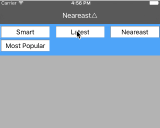

# DropdownMenu

[](http://cocoadocs.org/docsets/DropdownMenu/)
[](https://github.com/heartfly/DropdownMenu/blob/master/LICENSE)

<!--[](https://travis-ci.org/PhamBaTho/BTNavigationDropdownMenu)-->

## Demo


## Usage

To run the example project, clone the repo, and run `pod install` from the Example directory first.

```swift
class ViewController: UIViewController, DropdownMenuMixin { // Adding DropdownMenuMixin conformance 

    override func viewDidLoad() {
        super.viewDidLoad()
        self.title = "Smart"
        self.setupTitleDropdownMenu(["Smart", "Latest", "Neareast", "Most Popular"])//call setupTitleDropdownMenu to create a dropdown menu, the first parameter is the menu items list
    }
}
```

## Requirements

## Installation

DropdownMenu is available through [CocoaPods](http://cocoapods.org). To install
it, simply add the following line to your Podfile:

```ruby
pod "DropdownMenu"
```

## Author

Qiu Xinghao, qxh@mail.com

## License

DropdownMenu is available under the MIT license. See the LICENSE file for more info.
